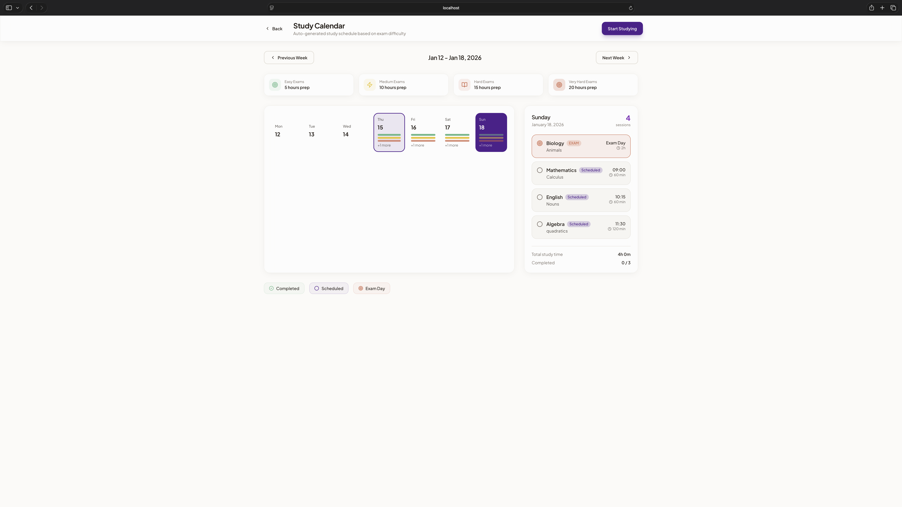
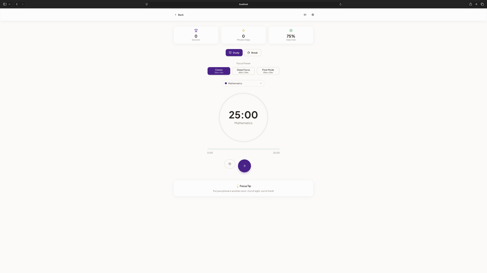

# StudyFlow

A **privacy-first weekly study planner** for students. Organize your study schedule, add exams and project reminders, view a dynamic weekly calendar with event counts, and track your progress — all data is stored locally or synced with **Firebase** for authentication and persistence.

---

## 🚧 Under Construction

**Note:** StudyFlow is still in early development.

- Currently, there is a **fully functional local version** integrated with **Firebase authentication and database**, but it is **not yet publicly deployed**.  
- The public version showcases the redesigned UI for authentication, dashboard, calendar, and timer pages.  
- All main features—adding events, generating study plans, tracking study sessions, and notifications—are **already implemented locally** and will be rolled out to users soon.

---

## 📸 Screenshots

### Landing Page


### Dashboard


### Login


### Calendar


### Pomodoro Timer 


> Screenshots show the current UI; functionality will be added in future releases.

---

## Features

- **Weekly calendar view** – Displays one week at a time with easy navigation between weeks.  
- **Add and manage exams/projects** – Create, edit, and delete events.  
- **Dynamic event badges** – Each day shows the number of scheduled events.  
- **Click to view event details** – See full list of events for any day.  
- **Study plan generation** – Automatically create daily study schedules leading up to deadlines.  
- **Study tracking and scoring** – Track completed study sessions and get a study score.  
- **Privacy-focused** – Data is stored locally and optionally synced with Firebase.  
- **Responsive design** – Works on desktop and mobile browsers.  
- **Optional notifications** – Remind users of upcoming exams or study sessions.

---

## Usage

- Navigate weeks using Next / Previous buttons.  
- Click any day to see scheduled events.  
- Event badges update automatically based on the local database or Firebase sync.  

---

## Contributing

We welcome contributions! To contribute:

1. Fork the repository  
2. Create a feature branch:  
```bash
git checkout -b feature/my-feature
```
	3.	Commit your changes:
```bash
git commit -m "Add new feature"
```
	4.	Push to the branch:
```bash
git push origin feature/my-feature
```
	5.	Open a pull request.

> [!NOTE]
> All user data is either stored locally or managed via Firebase.

---

## License

StudyFlow is licensed for personal, educational, and contribution purposes only.
You may use, modify, and contribute to the project, but commercial use, resale, or distribution for profit is prohibited.

**License Text**

`Copyright (c) 2026 Niko Kurcic`

#### Permission is granted, free of charge, to any person obtaining a copy of this software and associated documentation files to:
  
  -	Use the Software locally for personal or educational purposes
  - Modify, merge, and contribute to the Software

#### Restrictions:

  -	You may not sell, distribute, or use the Software for commercial purposes
  -	You may not copy the design or UI for commercial projects

> The above copyright notice and this permission notice shall be included in all copies or substantial portions of the Software.

> [!CAUTION]
> THE SOFTWARE IS PROVIDED “AS IS”, WITHOUT WARRANTY OF ANY KIND.

---

> [!IMPORTANT]
> Stay tuned for updates — full functionality and features are coming soon!

---
