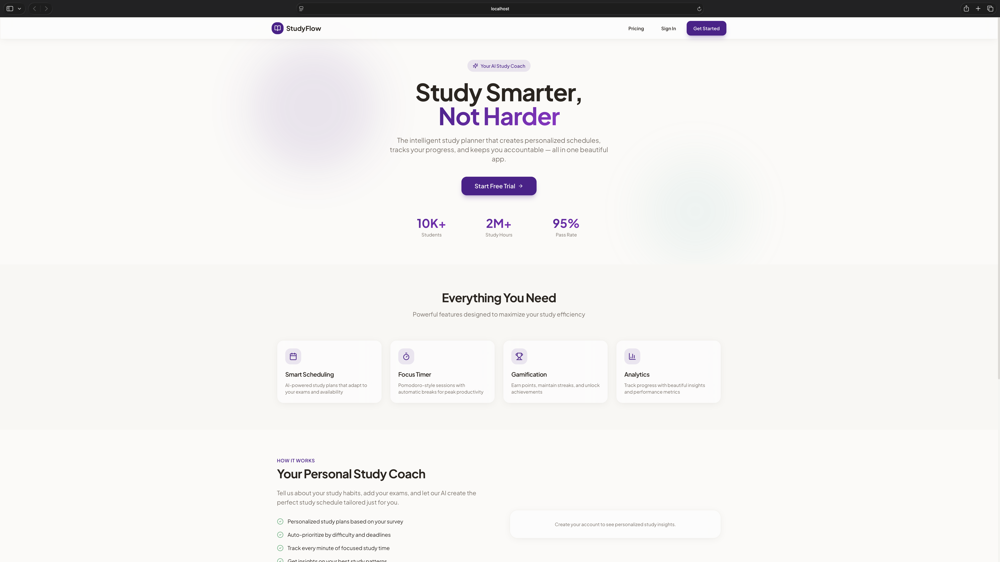
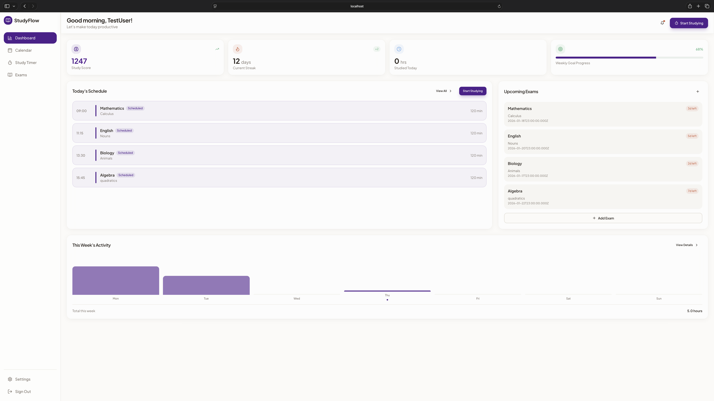
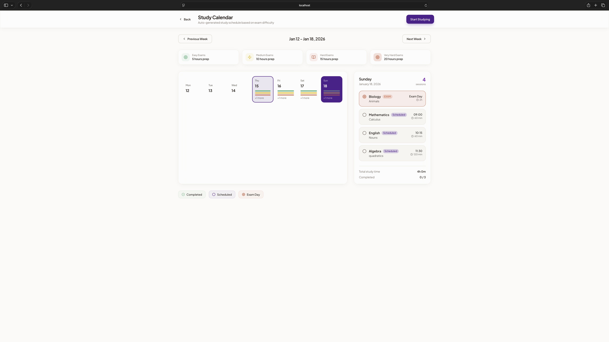

<h1 align="center">
  
   
  StudyFlow
</h1>

  Intelligent study planner with focus timer, exam tracking, and progress analytics.

  <a href="https://studyflowio.netlify.app/">studyflowio.netlify.app</a>

---

## What is StudyFlow?

**StudyFlow helps students study smarter by keeping everything in one place:**

- Exam tracking with difficulty levels and countdown timers
- Pomodoro-style focus sessions with multiple session modes
- Auto-generated weekly study schedules based on your exams
- Progress analytics — streaks, study hours, and weekly goals
- Calendar view with scheduled and completed sessions
- Full account system with session history and stats

**`No cloud required. Runs entirely in your browser.`**

---

## How It Works

Getting started with StudyFlow is fast:

1. **Create an account** – sign up with email and password, stored locally on your device.
2. **Add your exams** – enter subject, topic, date, and difficulty level.
3. **Start a focus session** – choose Pomodoro (25 min), Deep Focus (50 min), Flow State (90 min), or a break mode.
4. **Track your progress** – StudyFlow automatically calculates how many hours you've studied per subject and how much is left before each exam.
5. **Review your week** – the calendar shows scheduled sessions, completed sessions, and upcoming exams at a glance.

> [!TIP]
> Set your exam difficulty to **Very Hard** to get more study hours automatically scheduled in the lead-up to the exam date.

---

## Features

- **Focus Timer** — Pomodoro, Deep Focus, Flow State, Short & Long Break
- **Exam Tracker** — subject, topic, date, and difficulty level
- **Smart Schedule** — auto-generates daily study slots from your exams
- **Calendar** — weekly view with session indicators and day detail
- **Analytics** — study score, streak, and weekly goal progress
- **Settings** — clear sessions, delete account, view stats

---

## Screenshots

  

  

  

---

## Data & Privacy

StudyFlow stores all data **locally in your browser** using `localStorage`. Nothing is sent to any server.

> [!NOTE]
> Cross-device sync is currently in development. For now, your sessions, exams, and progress are tied to the device and browser you use.

> [!WARNING]
> Clearing your browser's site data or using private/incognito mode will erase your StudyFlow data.

---

<h3 align="center">
StudyFlow does not accept feature implementations via pull requests. Feature requests and bug reports are welcome through GitHub issues.
</h3>

---

  © 2026 Niko Marinović & Luka Protrka. All rights reserved.

