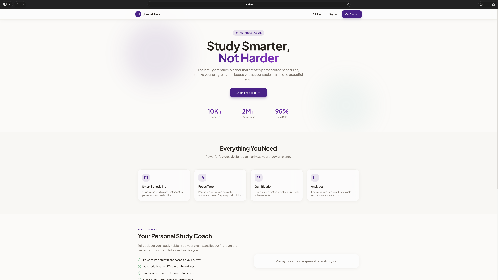
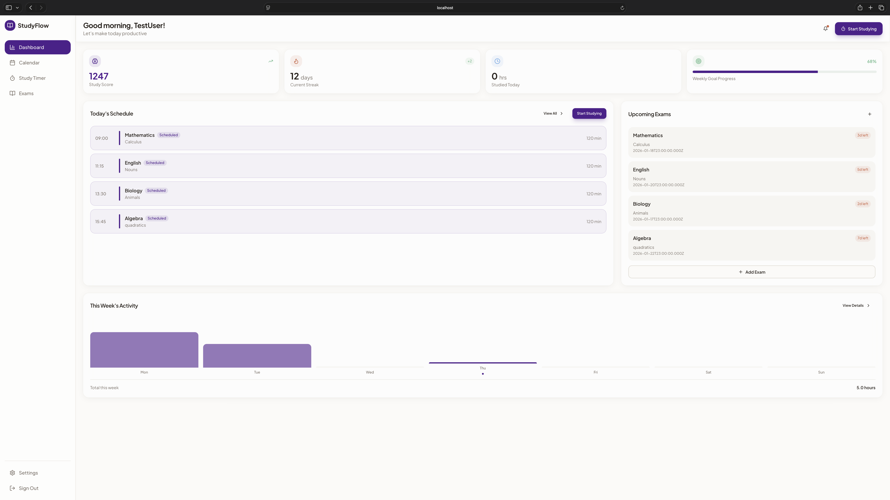
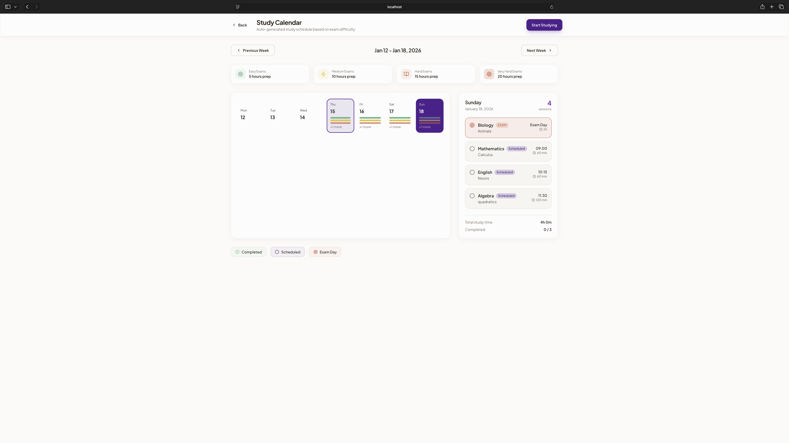

<h1 align="center">
  
   
  StudyFlow
</h1>

  Intelligent study planner with focus timer, exam tracking, and progress analytics.

  <a href="https://studyflowio.netlify.app/">studyflowio.netlify.app</a>

---

## What is StudyFlow?

**StudyFlow helps students study smarter by keeping everything in one place:**

- Exam tracking with difficulty levels and countdown timers
- Pomodoro-style focus sessions with multiple session modes
- Adaptive study planner: no "generate" button, the plan rebuilds itself whenever anything changes
- Progress analytics — streaks, study hours, and weekly goals
- Calendar view with scheduled and completed sessions
- Full account system with session history and stats
- Course workspaces with ECTS, per-course weighted assessment criteria, point entry, and assignments
- Academic planner with recurring timetable, weekly lab confirmation, availability, exam periods, and ECTS-weighted suggested sessions
- Per-course resources and a calendar with week, day, and month views

**Runs in your browser and syncs personal academic data through Firebase across devices.**

---

## How It Works

Getting started with StudyFlow is fast:

1. **Create an account** – sign up with email and password; your account is managed by Firebase Authentication.
2. **Add your exams** – enter subject, topic, date, and difficulty level.
3. **Start a focus session** – choose Pomodoro (25 min), Deep Focus (50 min), Flow State (90 min), or a break mode.
4. **Track your progress** – StudyFlow automatically calculates how many hours you've studied per subject and how much is left before each exam.
5. **Review your week** – the calendar shows scheduled sessions, completed sessions, and upcoming exams at a glance.

> [!TIP]
> Set your exam difficulty to **Very Hard** to get more study hours automatically scheduled in the lead-up to the exam date.

---

## Features

- **Focus Timer** — Pomodoro, Deep Focus, Flow State, Short & Long Break
- **Exam Tracker** — subject, topic, date, and difficulty level
- **Adaptive Planner** — keeps your study plan up to date automatically (see below)
- **Calendar** — weekly view with session indicators and day detail
- **Analytics** — study score, streak, and weekly goal progress
- **Settings** — clear sessions, delete account, view stats
- **Courses** — track ECTS, assessment weights, mandatory minimums, earned points, and assignment deadlines

---

## Adaptive Planner

The study plan is no longer generated with a button. `js/planner.js` recomputes it automatically whenever your timetable, availability, exams, assignments, one-day activities, exam periods, per-subject hours or completed sessions change, and as time passes.

- **Grouped days** — at most two subjects per day, each in one longer block (45–120 min), most urgent first. A third subject is only added when the next two weeks are very full.
- **Starts early** — study time is filled from the beginning of your availability window. If you can study from 10:00 on Sunday, the first session is at 10:00.
- **Hours per subject** — set Less / Normal / More / Maximum or extra hours per course on the Academic planner page, or tell the assistant ("više sati za linearnu algebru", "linearna algebra 10h tjedno").
- **One-day activities** — driving lessons, appointments and similar. The plan moves around them immediately; they disappear from the calendar once over and stay in the activity log. Recurring commitments can be added as weekly blocks.
- **Exam preparation** — each session is labelled Learn → Practice → Final review depending on how close the exam is; the subject whose exam is tomorrow always gets a final review. Hours ramp up towards the exam and are weighted by difficulty, ECTS and midterm/final.
- **Self-correcting** — missed or unfinished work flows back into the plan, a session you delete is treated as time you cannot study, a session you edit is left where you put it, and the plan tells you when a subject will not fit.

The assistant understands requests such as `autoškola u utorak od 17 do 18`, `svaki četvrtak 19:00-20:00 trening`, `u nedjelju mogu učiti od 10` and `ne mogu učiti u subotu`.

---

## Screenshots

  

  

  

---

## Data & Privacy

StudyFlow keeps a local cache for responsive use and syncs account records to the user's private Firestore path. Firebase Authentication manages sign-in. Firestore rules restrict each account to its own records.

> [!NOTE]
> Firebase project `studyflow-78e19` is configured for the current app and the deployed Netlify domain. See [FIREBASE_SETUP.md](FIREBASE_SETUP.md) when using a different deployment domain.

> [!WARNING]
> Clearing your browser's site data or using private/incognito mode will erase your StudyFlow data.

---

<h3 align="center">
StudyFlow does not accept feature implementations via pull requests. Feature requests and bug reports are welcome through GitHub issues.
</h3>

---

  © 2026 Niko Marinović & Luka Protrka. All rights reserved.

